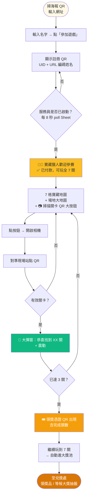
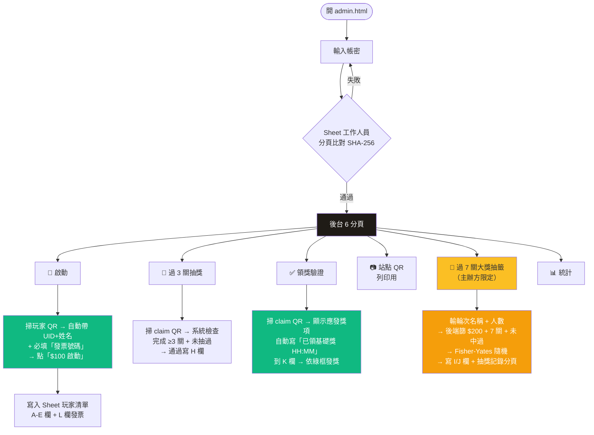
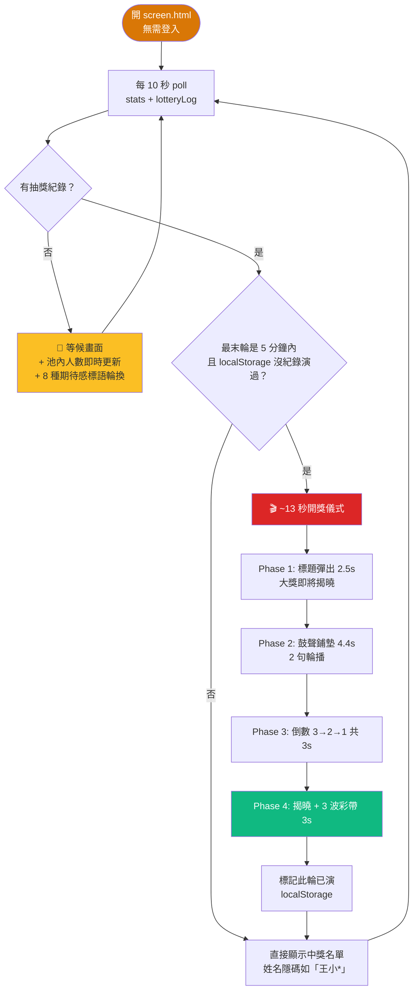
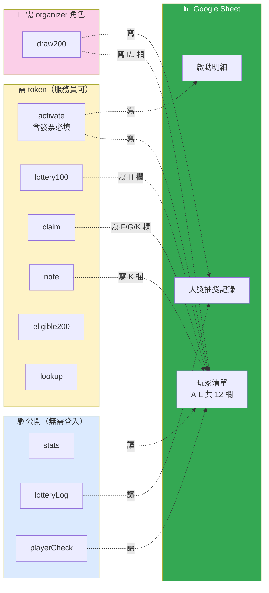
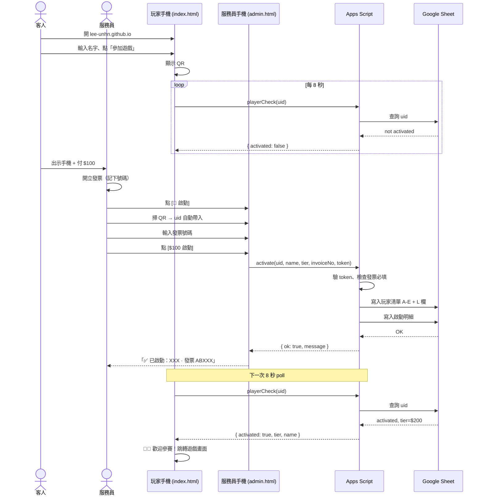
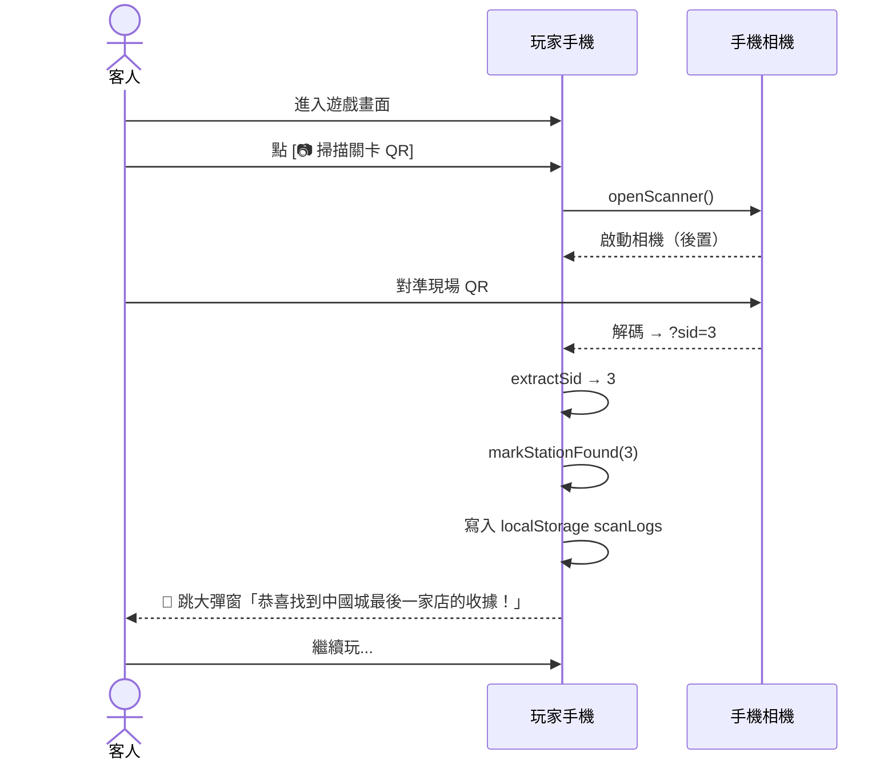
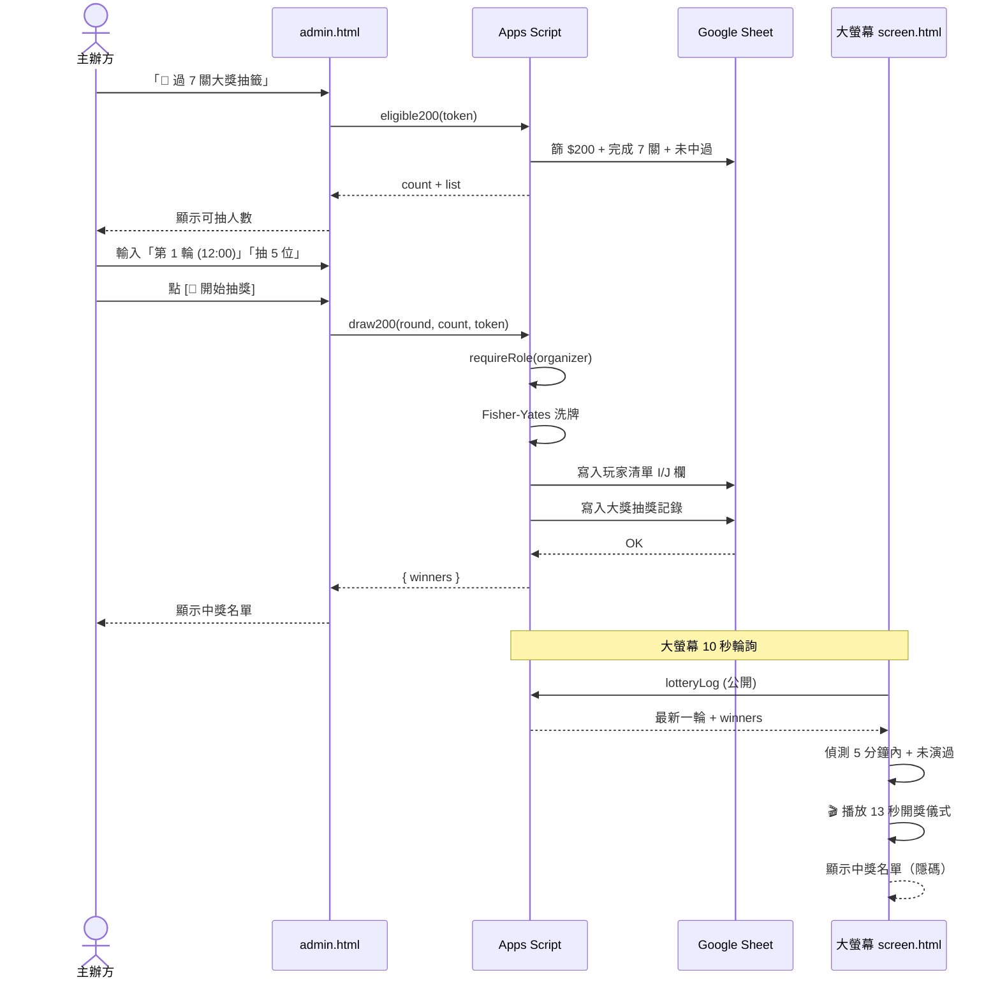

# 🏗 尋寶獵人 · 系統架構與流程

> 版本 v42（2026 春季尋寶 · 單一票價模式）

---

## 1. 整體架構

```mermaid
flowchart TB
    subgraph Frontend["📱 前端 · GitHub Pages 託管"]
        PLAYER["index.html<br/>👤 玩家頁"]
        ADMIN["admin.html<br/>🛠 後台<br/>（必須登入）"]
        SCREEN["screen.html<br/>📺 大螢幕<br/>（無需登入）"]
    end

    subgraph Storage["☁️ 資料層 · Google Sheet"]
        S1[玩家清單<br/>含 L 欄發票號碼]
        S2[大獎抽獎記錄]
        S3[啟動明細]
        S4[工作人員<br/>SHA-256 密碼]
        S5[設定<br/>門檻、輪次人數]
    end

    subgraph Backend["⚙️ Google Apps Script · Web App"]
        API["/exec<br/>10 個 action 端點"]
    end

    subgraph Hosting["🌐 GitHub"]
        REPO["repo: Lee-unhn/treasure-hunt"]
        PAGES["GitHub Pages CDN<br/>lee-unhn.github.io/treasure-hunt/"]
    end

    PLAYER -.→ |"playerCheck<br/>每 8 秒 poll"| API
    PLAYER -.→ |"掃站點 QR<br/>本機記錄"| LS[(localStorage<br/>個人進度)]
    ADMIN -.→ |"login/activate/claim/<br/>lottery100/draw200/note"| API
    SCREEN -.→ |"stats/lotteryLog<br/>(公開唯讀)"| API
    API <-.→ |"讀寫"| Storage

    REPO --> |"git push 自動部署"| PAGES
    PAGES --> PLAYER
    PAGES --> ADMIN
    PAGES --> SCREEN

    style PLAYER fill:#fff8e6
    style ADMIN fill:#1f1b16,color:#fff
    style SCREEN fill:#d97706,color:#fff
    style Storage fill:#34a853,color:#fff
    style API fill:#4285f4,color:#fff
    style PAGES fill:#000,color:#fff
```

---

## 2. 玩家流程



---

## 3. 服務員流程



---

## 4. 大螢幕流程



---

## 5. 資料寫入權限



---

## 6. 玩家清單 Sheet 欄位

| 欄 | 名稱 | 寫入時機 | 寫入者 |
|---|------|---------|--------|
| A | UID | 啟動時 | activate |
| B | 姓名 | 啟動時 | activate |
| C | 卡別 | 啟動時 | activate（單一票價：仍寫 $200）|
| D | 啟動時間 | 啟動時 | activate |
| E | 啟動服務員 | 啟動時 | activate |
| F | 完成關數 | 領獎驗證時 | claim |
| G | 完成時間 | 第一次領獎驗證 | claim |
| H | $100 抽獎時間 | 過 3 關抽獎時 | lottery100 |
| I | 大獎中獎輪次 | 大獎抽中時 | draw200 |
| J | 大獎中獎時間 | 大獎抽中時 | draw200 |
| K | 領獎/備註 | 領獎時自動 + 手動 | claim, note |
| **L** | **發票號碼** | **啟動時必填** | **activate** |

---

## 7. 關鍵設定一覽

| 項目 | 數值 |
|------|------|
| 活動模式 | 單一票價（$100） |
| 大獎參賽資格 | 完成 7 關（全員適用） |
| 玩家總關卡 | 7 關 |
| 過 N 關即時抽獎門檻 | 3 關 |
| 過 N 關大獎抽籤門檻 | 7 關 |
| Token 有效期 | 12 小時 |
| 玩家 poll 頻率 | 8 秒 |
| 大螢幕刷新頻率 | 10 秒 |
| 開獎儀式長度 | ~13 秒 |
| 站點 QR 列印 | 6 / 24 張每 A4（兩種模式可選） |

---

## 8. 啟動單筆完整流程（時序圖）



---

## 9. 站點掃描完整流程



---

## 10. 大獎抽籤完整流程


